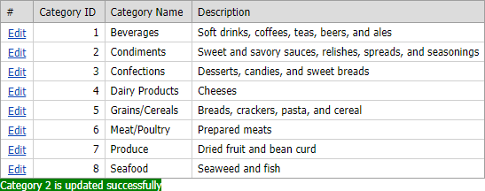

# GridView for Web Forms - How to update an external control during a callback
<!-- run online -->
**[[Run Online]](https://codecentral.devexpress.com/e2379/)**
<!-- run online end -->

A control can update only its own rendering in a callback. This example shows how to update the [ASPxLabel](https://docs.devexpress.com/AspNet/DevExpress.Web.ASPxLabel) control when a callback of the [ASPxGridView](https://docs.devexpress.com/AspNet/DevExpress.Web.ASPxGridView) control is finished.



[ASPxGridView](https://docs.devexpress.com/AspNet/DevExpress.Web.ASPxGridView) sends callbacks to update row data on the server. The control raises the [EndCallback](https://docs.devexpress.com/AspNet/js-ASPxClientGridView.EndCallback) client event after a callback is successfully executed. You can handle the event to perform custom actions with another control when a callback is finished.

```aspx
<dx:ASPxGridView ...>
    <ClientSideEvents EndCallback="OnEndCallBack" />
</dx:ASPxGridView>
```

The [ASPxGridView](https://docs.devexpress.com/AspNet/DevExpress.Web.ASPxGridView) implements the [JSProperties](https://docs.devexpress.com/AspNet/DevExpress.Web.ASPxGridBase.JSProperties) property that allows you to pass information from the server to the client. In this example, an updated row’s key is saved to the [JSProperties](https://docs.devexpress.com/AspNet/DevExpress.Web.ASPxGridBase.JSProperties) property on the server and then this value is used on the client to display information about the updated row.

```cs
protected void Page_Load(object sender, EventArgs e) {
    ASPxGridView1.JSProperties["cpIsUpdated"] = "";
}
protected void ASPxGridView1_RowUpdated(object sender, DevExpress.Web.Data.ASPxDataUpdatedEventArgs e) {
    if (e.Exception == null) {
        ((ASPxGridView)sender).JSProperties["cpIsUpdated"] = e.Keys[0];
    }
}
```

```js
function OnEndCallBack(s, e) {
    if (s.cpIsUpdated != '') {
        clientLabel.SetText('The category ' + s.cpIsUpdated + ' is updated successfully');
    }
    else {
        clientLabel.SetText('');
    }
}
```

## Files to Look At
<!-- default file list -->
- [Default.aspx](./CS/Default.aspx) (VB: [Default.aspx](./VB/Default.aspx))
- [Default.aspx.cs](./CS/Default.aspx.cs) (VB: [Default.aspx.vb](./VB/Default.aspx.vb))
<!-- default file list end -->

## Documentation

- [Callbacks](https://docs.devexpress.com/AspNet/402559/common-concepts/callbacks)
- [Update a Control in a Callback of Another Control (Workarounds)](https://docs.devexpress.com/AspNet/402219/common-concepts/callbacks/update-control-in-callback-of-another-control)